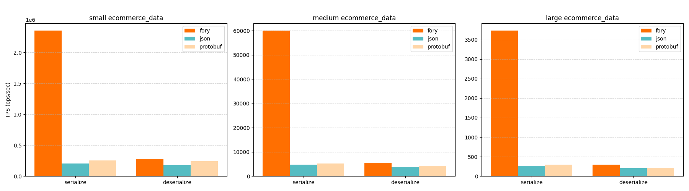
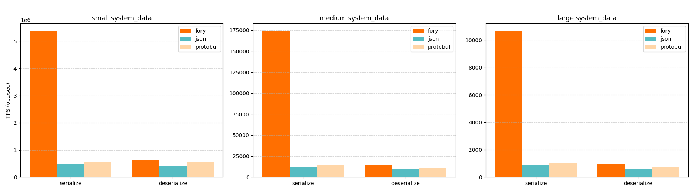

<div align="center">
  <br>
</div>

[](https://github.com/apache/fory/actions/workflows/ci.yml)
[](https://join.slack.com/t/fory-project/shared_invite/zt-36g0qouzm-kcQSvV_dtfbtBKHRwT5gsw)
[](https://x.com/ApacheFory)
[](https://search.maven.org/#search|gav|1|g:"org.apache.fory"%20AND%20a:"fory-core")
[](https://crates.io/crates/fory)
[](https://pypi.org/project/pyfory/)

**Apache Fory™** is a blazingly-fast multi-language serialization framework powered by **JIT compilation**, **zero-copy** techniques, and **advanced code generation**, achieving up to **170x performance improvement** while maintaining simplicity and ease of use.

<https://fory.apache.org>

> [!IMPORTANT]
> **Apache Fory™ was previously named as Apache Fury. For versions before 0.11, please use "fury" instead of "fory" in package names, imports, and dependencies, see [Fury Docs](https://fory.apache.org/docs/0.10/docs/introduction/) for how to use Fury in older versions**.

## Key Features

### 🚀 High-Performance Serialization

Apache Fory™ delivers exceptional performance through advanced optimization techniques:

- **JIT Compilation**: Runtime code generation for Java eliminates virtual method calls and inlines hot paths
- **Static Code Generation**: Compile-time code generation for Rust, C++, and Go delivers peak performance without runtime overhead
- **Zero-Copy Operations**: Direct memory access without intermediate buffer copies; row format enables random access and partial serialization
- **Meta Packing & Sharing**: Class metadata packing and sharing reduces redundant type information across serializations

### 🌍 Cross-Language Serialization

The **[xlang serialization format](docs/specification/xlang_serialization_spec.md)** enables seamless data exchange across programming languages:

- **Automatic Type Mapping**: Automatic conversion between language-specific types ([type mapping](docs/specification/xlang_type_mapping.md))
- **Reference Preservation**: Shared and circular references work correctly across languages
- **Polymorphism**: Objects serialize/deserialize with their actual runtime types
- **Schema Evolution**: Optional forward/backward compatibility for evolving schemas
- **Automatic Serialization**: No IDL or schema definitions required; serialize any object directly without code generation

### 📊 Row Format

A cache-friendly **[row format](docs/specification/row_format_spec.md)** optimized for analytics workloads:

- **Zero-Copy Random Access**: Read individual fields without deserializing entire objects
- **Partial Operations**: Selective field serialization and deserialization for efficiency
- **Apache Arrow Integration**: Seamless conversion to columnar format for analytics pipelines
- **Multi-Language**: Available in Java, Python, Rust and C++

### 🔒 Security & Production-Readiness

Enterprise-grade security and compatibility:

- **Class Registration**: Whitelist-based deserialization control (enabled by default)
- **Depth Limiting**: Protection against recursive object graph attacks
- **Configurable Policies**: Custom class checkers and deserialization policies
- **Platform Support**: Java 8-24, GraalVM native image, multiple OS platforms

## Protocols

Apache Fory™ implements multiple binary protocols optimized for different scenarios:

| Protocol                                                                  | Use Case                       | Key Features                                           |
| ------------------------------------------------------------------------- | ------------------------------ | ------------------------------------------------------ |
| **[Xlang Serialization](docs/specification/xlang_serialization_spec.md)** | Cross-language object exchange | Automatic serialization, references, polymorphism      |
| **[Java Serialization](docs/specification/java_serialization_spec.md)**   | High-performance Java-only     | Drop-in JDK serialization replacement, 100x faster     |
| **[Row Format](docs/specification/row_format_spec.md)**                   | Analytics and data processing  | Zero-copy random access, Arrow compatibility           |
| **Python Native**                                                         | Python-specific serialization  | Pickle/cloudpickle replacement with better performance |

All protocols share the same optimized codebase, allowing improvements in one protocol to benefit others.

## Benchmarks

> **Note**: Different serialization frameworks excel in different scenarios. Benchmark results are for reference only.
> For your specific use case, conduct benchmarks with appropriate configurations and workloads.

### Java Serialization Performance

The following benchmarks compare Fory against popular Java serialization frameworks. Charts labeled **"compatible"** show schema evolution mode with forward/backward compatibility enabled, while others show schema consistent mode where class schemas must match.

**Test Classes**:

- `Struct`: Class with [100 primitive fields](docs/benchmarks#Struct)
- `MediaContent`: Class from [jvm-serializers](https://github.com/eishay/jvm-serializers/blob/master/tpc/src/data/media/MediaContent.java)
- `Sample`: Class from [Kryo benchmark](https://github.com/EsotericSoftware/kryo/blob/master/benchmarks/src/main/java/com/esotericsoftware/kryo/benchmarks/data/Sample.java)

**Serialization Throughput**:

<p align="center">


</p>

**Deserialization Throughput**:

<p align="center">


</p>

**Important**: Fory's runtime code generation requires proper warm-up for performance measurement:

For additional benchmarks covering type forward/backward compatibility, off-heap support, and zero-copy serialization, see [Java Benchmarks](docs/benchmarks).

### Rust Serialization Performance

Fory Rust demonstrates competitive performance compared to other Rust serialization frameworks.

<p align="center">

</p>

<p align="center">

</p>

For more detailed benchmarks and methodology, see [Rust Benchmarks](benchmarks/rust_benchmark).

### C++ Serialization Performance

Fory Rust demonstrates competitive performance compared to protobuf c++ serialization framework.

<p align="center">

</p>

For more detailed benchmarks and methodology, see [C++ Benchmarks](benchmarks/cpp_benchmark).

## Installation

**Java**:

```xml
<dependency>
  <groupId>org.apache.fory</groupId>
  <artifactId>fory-core</artifactId>
  <version>0.14.1</version>
</dependency>
```

Snapshots are available from `https://repository.apache.org/snapshots/` (version `0.15.0-SNAPSHOT`).

**Scala**:

```sbt
// Scala 2.13
libraryDependencies += "org.apache.fory" % "fory-scala_2.13" % "0.14.1"

// Scala 3
libraryDependencies += "org.apache.fory" % "fory-scala_3" % "0.14.1"
```

**Kotlin**:

```xml
<dependency>
  <groupId>org.apache.fory</groupId>
  <artifactId>fory-kotlin</artifactId>
  <version>0.14.1</version>
</dependency>
```

**Python**:

```bash
pip install pyfory

# With row format support
pip install pyfory[format]
```

**Rust**:

```toml
[dependencies]
fory = "0.14"
```

**C++**:

Fory C++ supports both CMake and Bazel build systems. See [C++ Installation Guide](https://fory.apache.org/docs/guide/cpp/#installation) for detailed instructions.

**Golang**:

```bash
go get github.com/apache/fory/go/fory
```

## Quick Start

This section provides quick examples for getting started with Apache Fory™. For comprehensive guides, see the [Documentation](#documentation).

### Native Serialization

**Always use native mode when working with a single language.** Native mode delivers optimal performance by avoiding the type metadata overhead required for cross-language compatibility. Xlang mode introduces additional metadata encoding costs and restricts serialization to types that are common across all supported languages. Language-specific types will be rejected during serialization in xlang-mode.

#### Java Serialization

When you don't need cross-language support, use Java mode for optimal performance.

```java
import org.apache.fory.*;
import org.apache.fory.config.*;

public class Example {
  public static class Person {
    String name;
    int age;
  }

  public static void main(String[] args) {
    // Create Fory instance - should be reused across serializations
    BaseFory fory = Fory.builder()
      .withLanguage(Language.JAVA)
      .requireClassRegistration(true)
      // replace `build` with `buildThreadSafeFory` for Thread-Safe Usage
      .build();
    // Register your classes (required when class registration is enabled)
    // Registration order must be consistent if id is not specified
    fory.register(Person.class);
    // Serialize
    Person person = new Person();
    person.name = "chaokunyang";
    person.age = 28;
    byte[] bytes = fory.serialize(person);
    Person result = (Person) fory.deserialize(bytes);
    System.out.println(result.name + " " + result.age);  // Output: chaokunyang 28
  }
}
```

For detailed Java usage including compatibility modes, compression, and advanced features, see [Java Serialization Guide](docs/guide/java) and [java/README.md](java/README.md).

#### Python Serialization

Python native mode provides a high-performance drop-in replacement for pickle/cloudpickle with better speed and compatibility.

```python
from dataclasses import dataclass
import pyfory

@dataclass
class Person:
    name: str
    age: pyfory.int32

# Create Fory instance - should be reused across serializations
fory = pyfory.Fory()
# Register your classes (required when class registration is enabled)
fory.register_type(Person)
person = Person(name="chaokunyang", age=28)
data = fory.serialize(person)
result = fory.deserialize(data)
print(result.name, result.age)  # Output: chaokunyang 28
```

For detailed Python usage including type hints, compatibility modes, and advanced features, see [Python Guide](docs/guide/python).

#### Rust Serialization

Rust native mode provides compile-time code generation via derive macros for high-performance serialization without runtime overhead.

```rust
use fory::{Fory, ForyObject};

#[derive(ForyObject, Debug, PartialEq)]
struct Person {
    name: String,
    age: i32,
}

fn main() -> Result<(), fory::Error> {
    // Create Fory instance - should be reused across serializations
    let mut fory = Fory::default();
    // Register your structs (required when class registration is enabled)
    fory.register::<Person>(1);
    let person = Person {
        name: "chaokunyang".to_string(),
        age: 28,
    };
    let bytes = fory.serialize(&person);
    let result: Person = fory.deserialize(&bytes)?;
    println!("{} {}", result.name, result.age); // Output: chaokunyang 28
    Ok(())
}
```

For detailed Rust usage including collections, references, and custom serializers, see [Rust Guide](docs/guide/rust).

#### C++ Serialization

C++ native mode provides compile-time reflection via the `FORY_STRUCT` macro for efficient serialization with zero runtime overhead.

```cpp
#include "fory/serialization/fory.h"

using namespace fory::serialization;

struct Person {
    std::string name;
    int32_t age;
};
FORY_STRUCT(Person, name, age);

int main() {
    // Create Fory instance - should be reused across serializations
    auto fory = Fory::builder().build();
    // Register your structs (required when class registration is enabled)
    fory.register_struct<Person>(1);
    Person person{"chaokunyang", 28};
    auto bytes = fory.serialize(person).value();
    auto result = fory.deserialize<Person>(bytes).value();
    std::cout << result.name << " " << result.age << std::endl;  // Output: chaokunyang 28
}
```

For detailed C++ usage including collections, smart pointers, and error handling, see [C++ Guide](docs/guide/cpp).

#### Scala Serialization

Scala native mode provides optimized serialization for Scala-specific types including case classes, collections, and Option types.

```scala
import org.apache.fory.Fory
import org.apache.fory.config.Language
import org.apache.fory.serializer.scala.ScalaSerializers

case class Person(name: String, age: Int)

object Example {
  def main(args: Array[String]): Unit = {
    // Create Fory instance - should be reused across serializations
    val fory = Fory.builder()
      .withLanguage(Language.JAVA)
      .requireClassRegistration(true)
      .build()
    // Register Scala serializers for Scala-specific types
    ScalaSerializers.registerSerializers(fory)
    // Register your case classes
    fory.register(classOf[Person])
    val bytes = fory.serialize(Person("chaokunyang", 28))
    val result = fory.deserialize(bytes).asInstanceOf[Person]
    println(s"${result.name} ${result.age}")  // Output: chaokunyang 28
  }
}
```

For detailed Scala usage including collection serialization and integration patterns, see [Scala Guide](docs/guide/scala).

#### Kotlin Serialization

Kotlin native mode provides optimized serialization for Kotlin-specific types including data classes, nullable types, and Kotlin collections.

```kotlin
import org.apache.fory.Fory
import org.apache.fory.config.Language
import org.apache.fory.serializer.kotlin.KotlinSerializers

data class Person(val name: String, val age: Int)

fun main() {
    // Create Fory instance - should be reused across serializations
    val fory = Fory.builder()
        .withLanguage(Language.JAVA)
        .requireClassRegistration(true)
        .build()
    // Register Kotlin serializers for Kotlin-specific types
    KotlinSerializers.registerSerializers(fory)
    // Register your data classes
    fory.register(Person::class.java)
    val bytes = fory.serialize(Person("chaokunyang", 28))
    val result = fory.deserialize(bytes) as Person
    println("${result.name} ${result.age}")  // Output: chaokunyang 28
}
```

For detailed Kotlin usage including null safety and default value support, see [kotlin/README.md](kotlin/README.md).

### Cross-Language Serialization

**Only use xlang mode when you need cross-language data exchange.** Xlang mode adds type metadata overhead for cross-language compatibility and only supports types that can be mapped across all languages. For single-language use cases, always prefer native mode for better performance.

The following examples demonstrate serializing a `Person` object across Java and Rust. For other languages (Python, Go, JavaScript, etc.), simply set the language mode to `XLANG` and follow the same pattern.

**Java**

```java
import org.apache.fory.*;
import org.apache.fory.config.*;

public class XlangExample {
  public record Person(String name, int age) {}

  public static void main(String[] args) {
    // Create Fory instance with XLANG mode
    Fory fory = Fory.builder()
      .withLanguage(Language.XLANG)
      .build();

    // Register with cross-language type id/name
    fory.register(Person.class, 1);
    // fory.register(Person.class, "example.Person");
    Person person = new Person("chaokunyang", 28);
    byte[] bytes = fory.serialize(person);
    // bytes can be deserialized by Rust, Python, Go, or other languages
    Person result = (Person) fory.deserialize(bytes);
    System.out.println(result.name + " " + result.age);  // Output: chaokunyang 28
  }
}
```

**Rust**

```rust
use fory::{Fory, ForyObject};

#[derive(ForyObject, Debug)]
struct Person {
    name: String,
    age: i32,
}

fn main() -> Result<(), Error> {
    let mut fory = Fory::default();
    fory.register::<Person>(1)?;
    // fory.register_by_name::<Person>("example.Person")?;
    let person = Person {
        name: "chaokunyang".to_string(),
        age: 28,
    };
    let bytes = fory.serialize(&person);
    // bytes can be deserialized by Java, Python, Go, or other languages
    let result: Person = fory.deserialize(&bytes)?;
    println!("{} {}", result.name, result.age);  // Output: chaokunyang 28
}
```

**Key Points for Cross-Language Serialization**:

- Use `Language.XLANG` mode in all languages
- Register types with **consistent IDs or names** across all languages:
  - **By ID** (`fory.register(Person.class, 1)`): Faster serialization, more compact encoding, but requires coordination to avoid ID conflicts
  - **By name** (`fory.register(Person.class, "example.Person")`): More flexible, less prone to conflicts, easier to manage across teams, but slightly larger encoding
- Type IDs/names must match across all languages for successful deserialization
- Only use types that have cross-language mappings (see [Type Mapping](docs/specification/xlang_type_mapping.md))

For examples with **circular references**, **shared references**, and **polymorphism** across languages, see:

- [Cross-Language Serialization Guide](docs/guide/xlang)
- [Java Serialization Guide - Cross Language](docs/guide/java)
- [Python Guide - Cross Language](docs/guide/python)

### Row Format Encoding

Row format provides zero-copy random access to serialized data, making it ideal for analytics workloads and data processing pipelines.

#### Java

```java
import org.apache.fory.format.*;
import java.util.*;
import java.util.stream.*;

public class Bar {
  String f1;
  List<Long> f2;
}

public class Foo {
  int f1;
  List<Integer> f2;
  Map<String, Integer> f3;
  List<Bar> f4;
}

RowEncoder<Foo> encoder = Encoders.bean(Foo.class);
Foo foo = new Foo();
foo.f1 = 10;
foo.f2 = IntStream.range(0, 1000000).boxed().collect(Collectors.toList());
foo.f3 = IntStream.range(0, 1000000).boxed().collect(Collectors.toMap(i -> "k"+i, i -> i));

List<Bar> bars = new ArrayList<>(1000000);
for (int i = 0; i < 1000000; i++) {
  Bar bar = new Bar();
  bar.f1 = "s" + i;
  bar.f2 = LongStream.range(0, 10).boxed().collect(Collectors.toList());
  bars.add(bar);
}
foo.f4 = bars;

// Serialize to row format (can be zero-copy read by Python)
BinaryRow binaryRow = encoder.toRow(foo);

// Deserialize entire object
Foo newFoo = encoder.fromRow(binaryRow);

// Zero-copy access to nested fields without full deserialization
BinaryArray binaryArray2 = binaryRow.getArray(1);  // Access f2 field
BinaryArray binaryArray4 = binaryRow.getArray(3);  // Access f4 field
BinaryRow barStruct = binaryArray4.getStruct(10);   // Access 11th Bar element
long value = barStruct.getArray(1).getInt64(5);     // Access nested value

// Partial deserialization
RowEncoder<Bar> barEncoder = Encoders.bean(Bar.class);
Bar newBar = barEncoder.fromRow(barStruct);
Bar newBar2 = barEncoder.fromRow(binaryArray4.getStruct(20));
```

#### Python

```python
from dataclasses import dataclass
from typing import List, Dict
import pyarrow as pa
import pyfory

@dataclass
class Bar:
    f1: str
    f2: List[pa.int64]

@dataclass
class Foo:
    f1: pa.int32
    f2: List[pa.int32]
    f3: Dict[str, pa.int32]
    f4: List[Bar]

encoder = pyfory.encoder(Foo)
foo = Foo(
    f1=10,
    f2=list(range(1000_000)),
    f3={f"k{i}": i for i in range(1000_000)},
    f4=[Bar(f1=f"s{i}", f2=list(range(10))) for i in range(1000_000)]
)

# Serialize to row format
binary: bytes = encoder.to_row(foo).to_bytes()

# Zero-copy random access without full deserialization
foo_row = pyfory.RowData(encoder.schema, binary)
print(foo_row.f2[100000])           # Access element directly
print(foo_row.f4[100000].f1)        # Access nested field
print(foo_row.f4[200000].f2[5])     # Access deeply nested field
```

For more details on row format, see [Row Format Specification](docs/specification/row_format_spec.md).

## Documentation

### User Guides

| Guide                            | Description                                | Source                                          | Website                                                             |
| -------------------------------- | ------------------------------------------ | ----------------------------------------------- | ------------------------------------------------------------------- |
| **Java Serialization**           | Comprehensive guide for Java serialization | [java](docs/guide/java)                         | [📖 View](https://fory.apache.org/docs/guide/java/)                 |
| **Python**                       | Python-specific features and usage         | [python](docs/guide/python)                     | [📖 View](https://fory.apache.org/docs/guide/python/)               |
| **Rust**                         | Rust implementation and patterns           | [rust](docs/guide/rust)                         | [📖 View](https://fory.apache.org/docs/guide/rust/)                 |
| **C++**                          | C++ implementation and patterns            | [cpp](docs/guide/cpp)                           | [📖 View](https://fory.apache.org/docs/guide/cpp/)                  |
| **Scala**                        | Scala integration and best practices       | [scala](docs/guide/scala)                       | [📖 View](https://fory.apache.org/docs/guide/scala/)                |
| **Cross-Language Serialization** | Multi-language object exchange             | [xlang](docs/guide/xlang)                       | [📖 View](https://fory.apache.org/docs/guide/xlang/)                |
| **GraalVM**                      | Native image support and AOT compilation   | [graalvm_guide.md](docs/guide/graalvm_guide.md) | [📖 View](https://fory.apache.org/docs/guide/graalvm_serialization) |
| **Development**                  | Building and contributing to Fory          | [DEVELOPMENT.md](docs/guide/DEVELOPMENT.md)     | [📖 View](https://fory.apache.org/docs/guide/development)           |

### Protocol Specifications

| Specification           | Description                    | Source                                                                        | Website                                                                             |
| ----------------------- | ------------------------------ | ----------------------------------------------------------------------------- | ----------------------------------------------------------------------------------- |
| **Xlang Serialization** | Cross-language binary protocol | [xlang_serialization_spec.md](docs/specification/xlang_serialization_spec.md) | [📖 View](https://fory.apache.org/docs/specification/fory_xlang_serialization_spec) |
| **Java Serialization**  | Java-optimized protocol        | [java_serialization_spec.md](docs/specification/java_serialization_spec.md)   | [📖 View](https://fory.apache.org/docs/specification/fory_java_serialization_spec)  |
| **Row Format**          | Row-based binary format        | [row_format_spec.md](docs/specification/row_format_spec.md)                   | [📖 View](https://fory.apache.org/docs/specification/fory_row_format_spec)          |
| **Type Mapping**        | Cross-language type conversion | [xlang_type_mapping.md](docs/specification/xlang_type_mapping.md)             | [📖 View](https://fory.apache.org/docs/specification/fory_xlang_serialization_spec) |

## Compatibility

### Schema Compatibility

Apache Fory™ supports class schema forward/backward compatibility across **Java, Python, Rust, and Golang**, enabling seamless schema evolution in production systems without requiring coordinated upgrades across all services. Fory provides two schema compatibility modes:

1. **Schema Consistent Mode (Default)**: Assumes identical class schemas between serialization and deserialization peers. This mode offers minimal serialization overhead, smallest data size, and fastest performance: ideal for stable schemas or controlled environments.

2. **Compatible Mode**: Supports independent schema evolution with forward and backward compatibility. This mode enables field addition/deletion, limited type evolution, and graceful handling of schema mismatches. Enable using `withCompatibleMode(CompatibleMode.COMPATIBLE)` in Java, `compatible=True` in Python, `compatible_mode(true)` in Rust, or `NewFory(true)` in Go.

### Binary Compatibility

**Current Status**: Binary compatibility is **not guaranteed** between Fory major releases as the protocol continues to evolve. However, compatibility **is guaranteed** between minor versions (e.g., 0.13.x).

**Recommendations**:

- Version your serialized data by Fory major version
- Plan migration strategies when upgrading major versions
- See [upgrade guide](docs/guide/java) for details

**Future**: Binary compatibility will be guaranteed starting from Fory 1.0 release.

## Security

### Overview

Serialization security varies by protocol:

- **Row Format**: Secure with predefined schemas
- **Object Graph Serialization** (Java/Python native): More flexible but requires careful security configuration

Dynamic serialization can deserialize arbitrary types, which may introduce risks. For example, the deserialization may invoke `init` constructor or `equals/hashCode` method; If the method body contains malicious code, the system will be at risk.

Fory enables class registration **by default** for dynamic protocols, allowing only trusted registered types.
**Do not disable class registration unless you can ensure your environment is secure**.

If this option is disabled, you are responsible for serialization security. You should implement and configure a customized `ClassChecker` or `DeserializationPolicy` for fine-grained security control

To report security vulnerabilities in Apache Fory™, please follow the [ASF vulnerability reporting process](https://apache.org/security/#reporting-a-vulnerability).

## Community and Support

### Getting Help

- **Slack**: Join our [Slack workspace](https://join.slack.com/t/fory-project/shared_invite/zt-36g0qouzm-kcQSvV_dtfbtBKHRwT5gsw) for community discussions
- **Twitter/X**: Follow [@ApacheFory](https://x.com/ApacheFory) for updates and announcements
- **GitHub Issues**: Report bugs and request features at [apache/fory](https://github.com/apache/fory/issues)
- **Mailing Lists**: Subscribe to Apache Fory mailing lists for development discussions

### Contributing

We welcome contributions! Please read our [Contributing Guide](CONTRIBUTING.md) to get started.

**Ways to Contribute**:

- 🐛 Report bugs and issues
- 💡 Propose new features
- 📝 Improve documentation
- 🔧 Submit pull requests
- 🧪 Add test cases
- 📊 Share benchmarks

See [Development Guide](docs/guide/DEVELOPMENT.md) for build instructions and development workflow.

## License

Apache Fory™ is licensed under the [Apache License 2.0](LICENSE).
